# 🛠️ Jenkins DevOps Project

## 📘 Project Overview

This project demonstrates a complete DevOps pipeline for deploying a scalable **Node.js** application to **AWS** using modern **CI/CD** and **Infrastructure-as-Code** practices. The pipeline automates infrastructure provisioning, configuration, deployment, and monitoring by integrating:

> 🧩 **Terraform**, **Ansible**, **Jenkins**, **Docker**, **AWS**, and **GitHub Webhooks**

---

## 🎯 Key Objectives

- 🔧 Provision infrastructure using **Terraform**: VPC, Bastion Host, private EC2 instances, RDS, Redis, and an Application Load Balancer.
- 🛠️ Configure Jenkins slave on a **private EC2** using **Ansible**.
- 🐳 Run **Jenkins master** in a Docker container.
- 🔁 Set up **Jenkins Pipelines** to build and deploy a **Node.js** app from the `main` branch using **GitHub Webhooks**.
- 🔐 Enable **SSH port forwarding** and **proxy configuration** to securely access private instances.
- 🌐 Expose the app using an **AWS Application Load Balancer**.
- 🧪 Test endpoints interacting with **RDS** and **Redis**.
- 🔑 Manage application secrets and credentials via Jenkins.

---

## 🧰 Tech Stack

- **Terraform** – Infrastructure provisioning
- **Ansible** – Instance configuration
- **Jenkins** – CI/CD automation
- **Docker** – Containerized Jenkins
- **AWS** – EC2, RDS, ALB, Redis
- **Node.js** – Application runtime
- **GitHub Webhooks** – Build triggers

---

## 🔁 Fork & Clone the Repo

1. **Fork** this repo:
   [https://github.com/mina-safwat-1/jenkins-devops-project](https://github.com/mina-safwat-1/jenkins-devops-project)

2. **Clone** your fork:
   ```bash
   git clone https://github.com/<your-username>/jenkins-devops-project.git
   cd jenkins-devops-project/terraform
   ```

---

## 🚀 Project Setup

### ✅ Step 1: Generate SSH Keys

```bash
cd terraform
ssh-keygen -t rsa -b 4096 -f my-aws-key -N ""
chmod 400 my-aws-key
cp my-aws-key ~/.ssh/my-aws-key
```

---

### ✅ Step 2: Terraform Infrastructure

```bash
terraform init
terraform apply -var-file vars.tfvars
```

Provide:
- `db_username`
- `db_password`

Terraform provisions:
- Public EC2 (Bastion)
- Private EC2 (Jenkins Slave)
- RDS (MySQL)
- Redis
- Application Load Balancer
- VPC

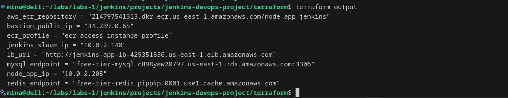

---

### ✅ Step 3: Start Jenkins Master (Docker)

```bash
docker container run -d -v jenkins_home:/var/jenkins_home -p 8080:8080 jenkins/jenkins:lts
```

---

### ✅ Step 4: SSH Config (Tunneling)

Edit or create `~/.ssh/config`:

```ssh
Host bastion
  HostName <public_ip_bastion>
  User ubuntu
  IdentityFile ~/.ssh/my-aws-key

Host jenkins-slave
  HostName <private_ip_jenkins_slave>
  User ubuntu
  IdentityFile ~/.ssh/my-aws-key
  ProxyJump bastion
```

---

### ✅ Step 5: Configure Jenkins Slave via Ansible

```bash
cd ansible/jenkins_slave
ansible-playbook ansible.yml
```

---

### ✅ Step 6: Enable Port Forwarding

On Bastion:
```bash
ssh bastion
sudo bash -c 'echo -e "GatewayPorts yes\nAllowTcpForwarding yes" >> /etc/ssh/sshd_config'
sudo systemctl restart sshd
```

On Master:
```bash
ssh -i ~/.ssh/my-aws-key -R 8080:localhost:8080 ubuntu@<bastion_public_ip> -N
```

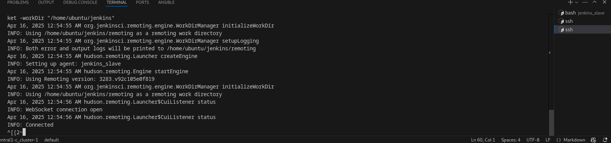  


---

## 🤖 Jenkins Slave Manual Setup

Get the agent setup script from **Manage Jenkins > Nodes > New Node**:

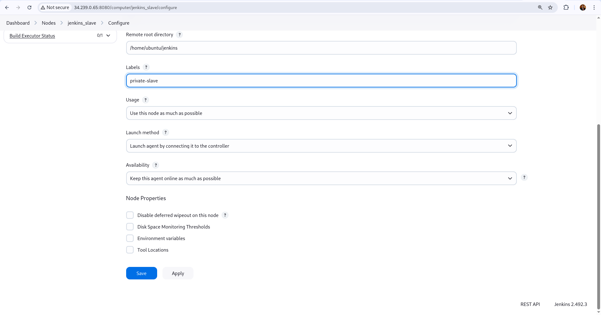  
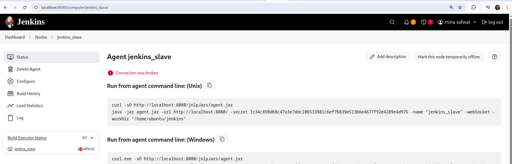

Then on the Jenkins slave:

```bash
ssh jenkins_slave
curl -sO http://<public_ip_bastion>:8080/jnlpJars/agent.jar

java -jar agent.jar \
  -url http://<public_ip_bastion>:8080/ \
  -secret <secret_key> \
  -name "jenkins_slave" \
  -webSocket -workDir "/home/ubuntu/jenkins"
```

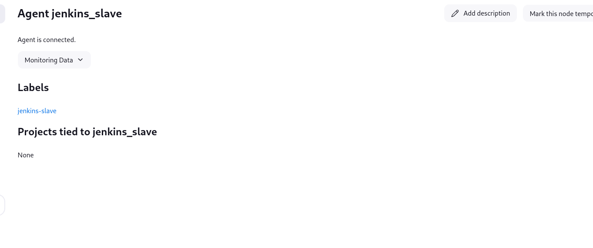

---

## 🔗 GitHub Webhook

Add the webhook in your GitHub repo:

```
http://<public_ip_bastion>:8080/github-webhook/
```

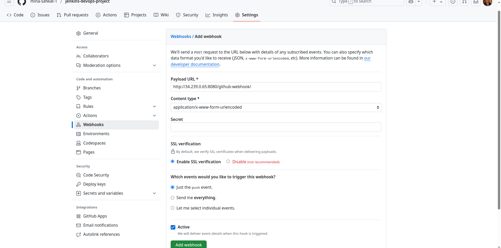

---

## 🔐 Jenkins Credentials Setup

Go to **Jenkins > Manage Credentials**, then add:

- `DB_USERNAME`
- `DB_PASSWORD`
- `AWS_ACCESS_KEY_ID`
- `AWS_SECRET_ACCESS_KEY`
- `ansible-ssh-key` (upload `terraform/my-aws-key`)

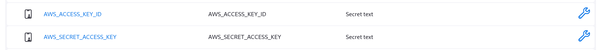

---

## ⚙️ Jenkins Pipeline Configuration

1. **Create a pipeline job**  
   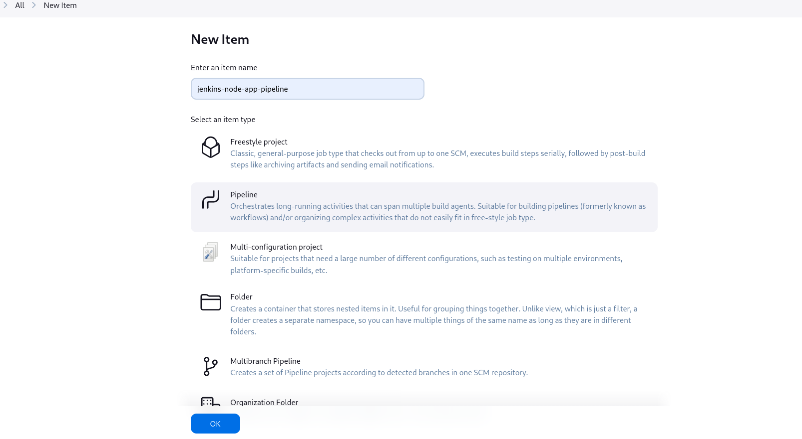

2. **Add trigger via webhook**  
   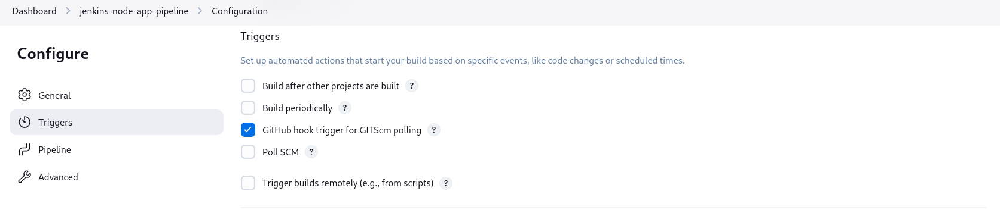

3. **Select the `main` branch**  
   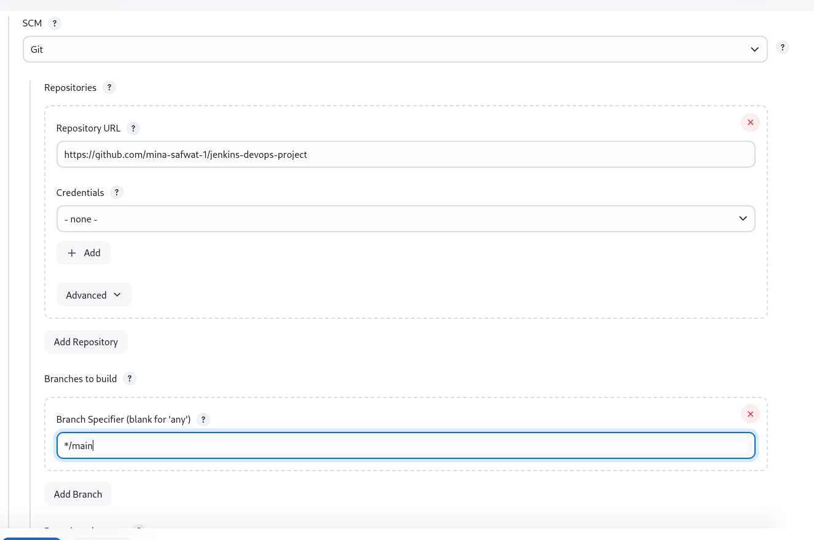

4. **Add a Jenkinsfile script** for build, test, and deployment  
   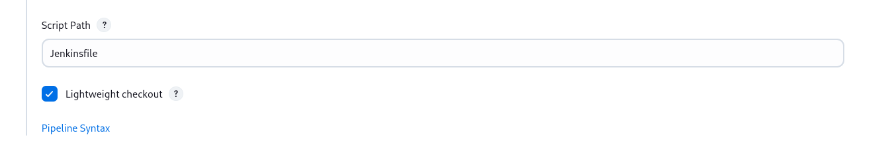

---

## 📦 Push Changes & Trigger Pipeline

Change the code and push to `main` — Jenkins will build and deploy.

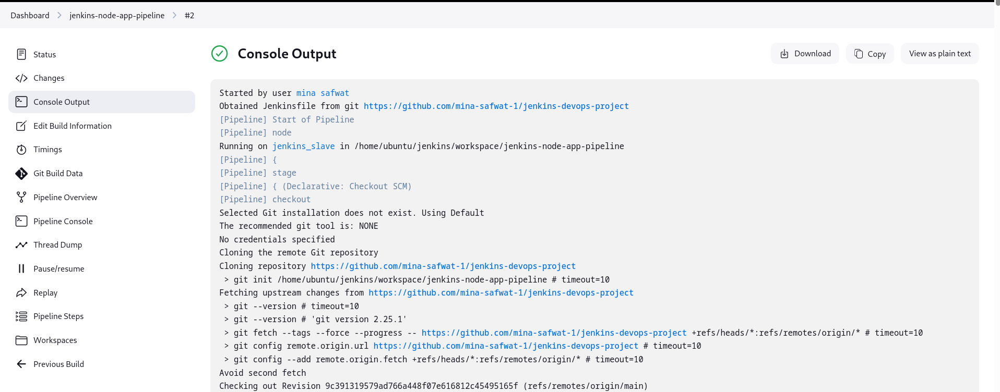

---

## 🌐 Application Endpoints (via ALB)

- **Redis endpoint:**
  ```
  http://<load_balancer_dns>/redis
  ```

- **Database endpoint:**
  ```
  http://<load_balancer_dns>/db
  ```

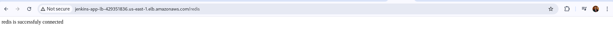

---


## ✅ Conclusion

This project showcases how to implement a full DevOps pipeline using Jenkins, Terraform, Ansible, Docker, and AWS. From provisioning infrastructure to automating deployments and securely accessing private environments, it brings together best practices in CI/CD, Infrastructure as Code, and automation.

You now have:

- A scalable and secure Node.js app running on AWS.
- A fully automated CI/CD pipeline powered by Jenkins.
- Dynamic infrastructure provisioned and managed through code.
- Real-time build triggers via GitHub Webhooks.

---

## 🙌 Acknowledgments

Special thanks to the open-source community and the creators of the tools used in this project.

---

## 🧠 Future Improvements

- Integrate monitoring and alerting (e.g., Prometheus + Grafana).
- Add testing and linting stages to the pipeline.
- Set up automatic scaling with AWS Auto Scaling Groups.
- Use Secrets Manager or HashiCorp Vault for better secrets management.

---
